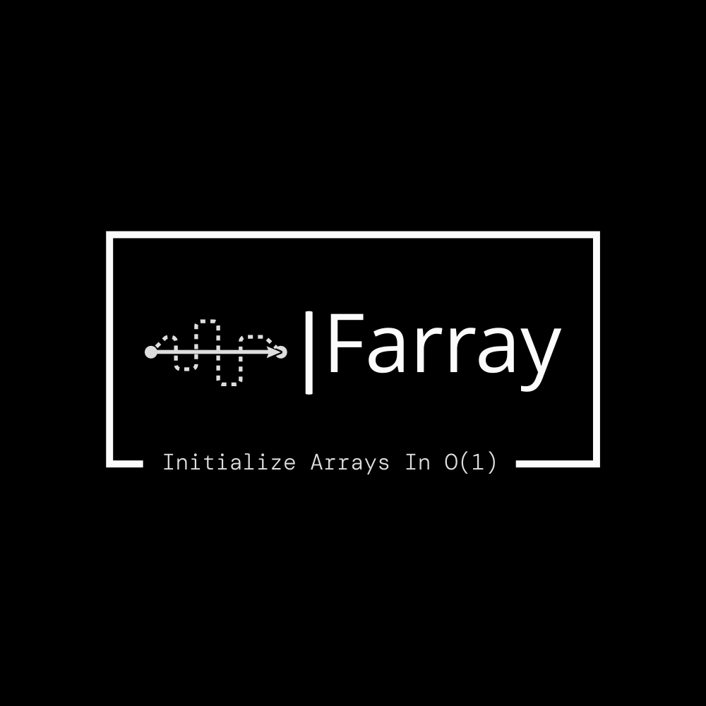

<div style="text-align: center;">
    
</div>

<div align="center">
  <a href="https://github.com/tomhea/farray/actions/workflows/tests.yml"></a>
</div>

## Initialize arrays in constant time

C++ **Header-only** Implementation of the [In-Place Initializable Arrays](https://arxiv.org/abs/1709.08900) paper.

It's a templated array with **constant-time** fill(v), read(i), write(i,v) operations, all with just 1 bit of extra memory.<br>
You can really [sense the **speedup**](#is-it-really-better) it provides.

This **single-file** library is [**thoroughly tested**](tests/tests_farray1.cpp), and is **Embedded-friendly** as it has no exceptions, and use no other library. It can also use no dynamic allocations.

The paper is based on the simpler [Initializing an array in constant time](https://eli.thegreenplace.net/2008/08/23/initializing-an-array-in-constant-time) - which uses 2n extra memory words.<br>
I wrote a **[Medium article](https://link.medium.com/Q8YbkDJX2bb)** about array initialization and this project. Read it and come back 🧑‍💻. 

# Basic Use:
To use the array, just download and include the header file. *That's it.*
```c
#include "farray1.hpp"
```

If you want to compile it without any dynamic allocations:
```c
#define FARRAY1_NO_DYNAMIC_ALLOCATIONS
#include "farray1.hpp"
```

### Using the Farray1 class:
```c
// initialization (all to 1s)
Farray1<int> A(n, 1);   // Farray1 allocated an array be itself. 
                        // It can also take an already allocated array as a parameter.

// read & write
A[3] = 5;
int x = A[12] + A[19] + A[3];   // reading (1+1+5)

cout << "This must be seven: " << x << endl;

// simple initialization - all values are now 2020
A = 2020;     

for (int i = 5; i <= 10; i++)
    A[i] = i*i;
    
for (int i = 3; i <= 12; i++)
    cout << A[i] << " ";
```

The output will be:
```
This must be seven: 7
2020 2020 25 36 49 64 81 100 2020 2020 
```

You can also use the `A.fill(v), A.read(i), A.write(i,v)` syntax,<br>
instread of `A=v, A[i], A[i]=v`.<br>
Also, indexing is circular, so ```A[i] is A[i % n]``` (e.g ```A[2n+5] == A[5]```).

# How much Faster? 🚀

Take a look at the time [speedups](timings/times_farray1_output.txt) gained by using Farray1 over a regular array.
```
Speedups of the average operation (read/write/fill) on Farray1/c-arrays of size 1000000:

When 10% of the operations are array-fills:
  Farray1<int64_t, 1000000> is 570 times(!) faster than int64_t[1000000].

When 2% of the operations are array-fills:
  Farray1<int64_t, 1000000> is 110 times(!) faster than int64_t[1000000].

When Only 0.2% of the operations are array-fills:
  Farray1<int64_t, 1000000> is  12 times(!) faster than int64_t[1000000].

When Only 0.05% of the operations are array-fills:
  Farray1<int64_t, 1000000> is   3 times(!) faster than int64_t[1000000].
```
You can also run the timings benchmark on your pc with [times_farray1.cpp](timings/times_farray1.cpp) (takes about 5 minutes).


# Farray Website!

This project has a [Website](https://tomhea.github.io/farray/)! containing more information:<br>
* [Short Despription about the algorithm](https://tomhea.github.io/farray/Short-Description.html)
* [Advanced Features](https://tomhea.github.io/farray/Advanced-Features.html) - iterator, direct-functions, smaller-blocks, templates
* Much More!

